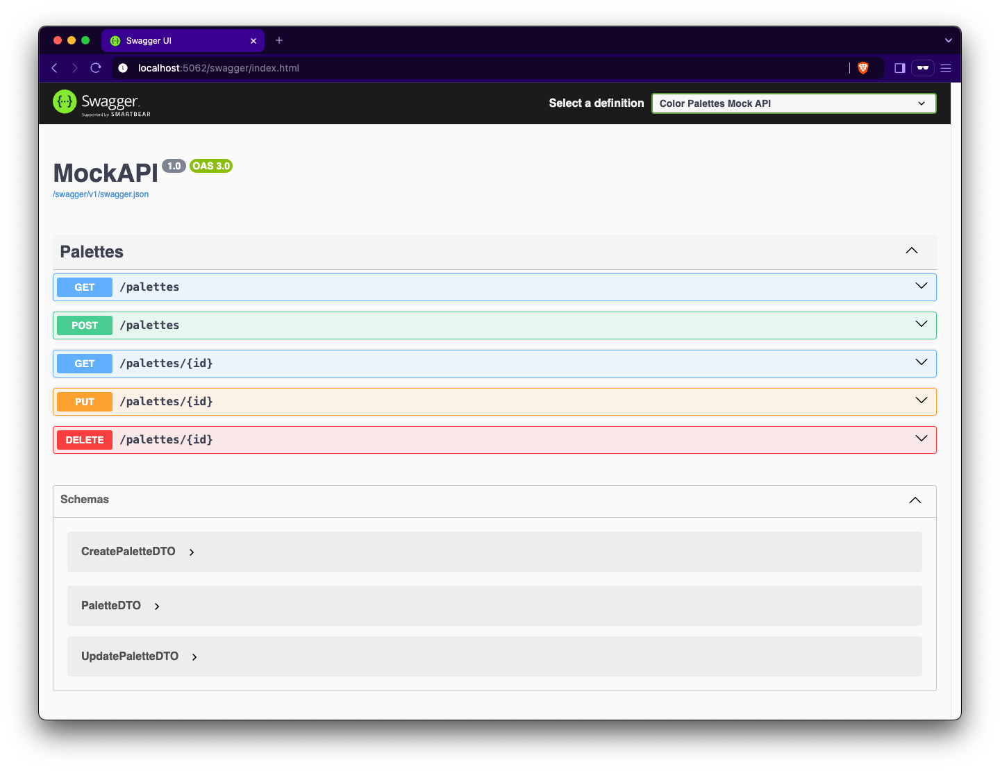

## Color Palettes Mock API

- A simple `mock API` built with `C#`, `.NET Core` and `EF Core` to manage color palettes with CRUD operations.

### Getting Started

1. Clone the repository.
```sh
git clone https://github.com/otegecmis/color-palettes-mock-api.git
```

2. Navigate to the MockAPI directory.
```sh
cd color-palettes-mock-api/MockAPI
```

3. Restore dependencies.
```sh
dotnet restore
```

4. Run the application.
```sh
dotnet run
```

### Database Configuration

Set `RecreateDatabaseOnStart` to `true` in `launchSettings.json` to recreate the database on each run.

Example:
```json
{
  "profiles": {
    "http": {
      "environmentVariables": {
        "RecreateDatabaseOnStart": true
      }
    }
  }
}
```

By default, this option is `false`.

### API Documentation

Access `Swagger UI` at `/swagger` to test the API.

<div style="float: left;">
    
</div>
